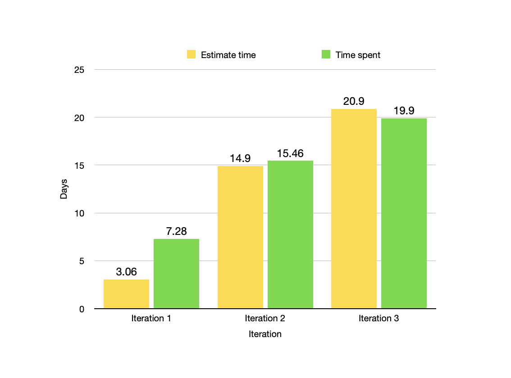

# Retrospective
Multiple aspects have yet to be as successful as our team expected. On the technical side, multiple user database bugs and other minor bugs that were not detected during the initial code review demanded extra work from our team to address which slowed the overall progress. This timeline disruption due to minor bugs could be addressed by setting stricter deadlines that account for extra bug-fixing if necessary.

Another challenge that our team faced was the untimely testing of the newly produced code, not having proper test-driven development. The delay between the implementation of a piece of code and its testing created scheduling issues and ultimately resulted in not thorough and insufficient testing overall. To solve this issue, we can orient our team toward test-driven development where the test for an implemented piece of code is written before. 

Our team also encountered several challenges with code readability and a general understanding of each other’s solutions. These misunderstandings were disrupting and they can be eliminated by attaching individual issues to the commit messages to make them more readable and easier to parse, notifying the team about changes and creations of interfaces, as well as writing more detailed pull request descriptions. 

Many last-minute issues such as old non-functional code remain in the project due to the hurried fixes left a disproportionate workload for the last days before the deadline. Careful individual workload management with more frequent check-ins can help our team avoid an increased influx of pending tasks last minute.

# Main disastisfactions

## Paying dept more that developing
- What to improve: Team spends more time fixing existing issues than developing new features
because there is no/insufficient high-level vision among team members.
- How to improve: Brief each other on the overall progress every meeting, restate overall goals,
and explain each other understand how their individual task contributes to the project to
promote self-coordination.
- How to evaluate: See if self-coordination among the team members increased. This happens
when there is less micromanagement (reassigning of individual tasks) to be done/has to be
done

## Inefficient code review
- What to improve: Issues in code are not getting fixed as soon as they are detected which leads
to the increased workload during the last day before the deadline.
- How to improve: Mandate (implement a policy) team members to test and correct their code
when they write it and discourage postponed debugging.
- How to evaluate: Evaluate if the amount of time spending recoding/debugging the last merge meeting before the deadline of the current iteration is decreased compared to the
amount of such work of the previous iteration.

# Velocity Chart

- In Iteration 1 we totally underestimated the time it took to set up and get things rolling. Moreover we did not use the tracking tools to its full extent, making the data looks weird.
- In Iteration 2 we used the tools on GitLab better, but due to underestimating the time it would take to contruct a database, and the time just fixing bugs after merging, the actual time spent is still more than estimate, which left us in a very bad spot toward the end.
- In Iteration 3, this is the closest to what we have, estimate time spend on tasks and actual times are pretty close, we no longer overestimate our ability to get a task done and have less bugs and merge conflicts.